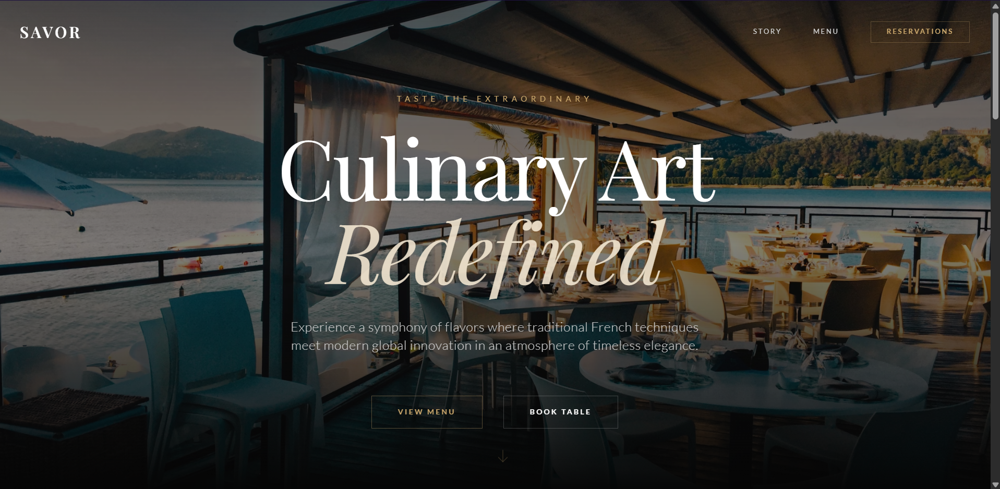

# Savor - Modern Fine Dining Experience



**Savor** is a premium, immersive web application designed for high-end restaurants. It combines sophisticated aesthetics with cutting-edge AI technology to deliver a unique user experience.

## 🌟 Key Features

*   **Immersive Design**: Smooth scroll animations, parallax effects, and a luxurious dark-themed UI.
*   **Responsive & Mobile-First**: Flawless experience across all devices, from desktop to mobile.
*   **Modern Tech Stack**: Built with performance and scalability in mind.

## 🛠️ Technology Stack

*   **Frontend**: React 19, Vite
*   **Styling**: Tailwind CSS (via CDN for rapid prototyping), Custom CSS Animations
*   **Language**: JavaScript (ESNext)

## 🚀 Live Demo

[Insert Vercel Deployment Link Here]

## 👨‍💻 Looking for a Developer?

I specialize in building high-performance, visually stunning web applications. Whether you need a landing page, a complex web app, or an AI integration, I can bring your vision to life.

**Services I Offer:**
*   Custom Web Application Development
*   UI/UX Implementation & Animation
*   React & Next.js Development

---

## 📦 Installation

1.  Clone the repository:
    ```bash
    git clone https://github.com/yourusername/savor-dining.git
    ```
2.  Install dependencies:
    ```bash
    npm install
    ```
3.  Run the development server:
    ```bash
    npm run dev
    ```

## 📄 License

MIT License
